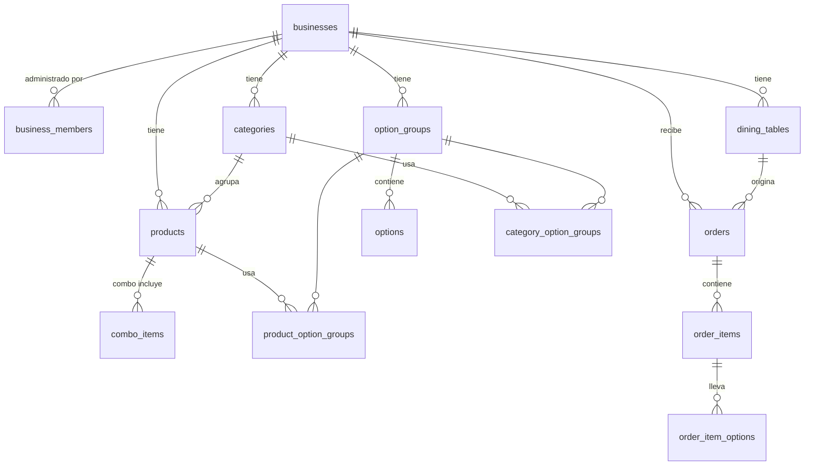

# MesaQR — Arquitectura (Fase 1)

> **Escanea. Elige. Envía tu pedido.**
> Menú digital por QR de mesa con pedidos por WhatsApp. Primer cliente: restaurante de comida rápida en Maracay, Aragua (Venezuela). Diseñado para evolucionar a SaaS multirestaurante.

Estado: **En producción con modelo de ENLACE ÚNICO** (7 oct. 2026).

> **Cambio de alcance aprobado por el cliente:** se eliminó el QR por mesa. Ahora hay **un solo enlace** que se comparte;
> el cliente indica nombre, tipo de pedido (para llevar / delivery / comer en el local), dirección si es delivery y forma
> de pago. API pública: `get_public_menu(slug)` y `create_public_order(slug, items, customer, notes)`
> (migración `20261007000003_menu_por_enlace.sql`). Las secciones sobre QR y mesas de este documento quedan como
> historia de diseño; la tabla `dining_tables` y las funciones por mesa siguen en la base sin acceso público.

> **V2 — "mesero digital"** (migración `20261007000004_experiencia_v2.sql`). Se agregan a `products`:
> - `badges`: etiquetas editoriales con valores cerrados por `check`; nunca estadísticas.
> - `cravings`: antojos para "¿No sabes qué pedir?".
> - `compare_at_price_usd`: el ahorro se muestra solo si es mayor que el precio.
> - `combo_upgrade_id`: FK compuesta al mismo negocio, `on delete set null`.
>
> También se agrega `order_items.notes` (observación por producto, máx. 140, validada en `create_public_order`). La firma de las funciones públicas no cambia.
>
> En el frontend:
> - la lógica pura del catálogo está en `src/features/menu/catalog.ts` (búsqueda, favoritos, ofertas, combo, sugerencias, antojos);
> - los textos y límites de la interfaz están en `src/shared/config/experience.ts`;
> - las vistas Inicio, Menú y Ofertas usan `?vista=` con `history.pushState`;
> - el carrito vive en `localStorage` con caducidad de 6 h.
>
> **No se implementó**, por decisión del cliente (solo enlace único): número de mesa, "Necesito ayuda" y "Pedir la cuenta".
Fecha: 2026-10-07

---

## 0. Inspección del entorno

| Elemento | Resultado |
|---|---|
| Proyecto existente | Ninguno. Directorio vacío → se construye desde cero. |
| Node / npm | Node 22.22, npm 10.9 |
| Git | Repositorio nuevo en `mesaqr/` (rama `main`) |
| Stack previo a respetar | No hay. Se adopta el stack preferido del brief. |
| Supabase | Aún no existe proyecto. Se necesitará en la Fase 3. |

---

## 1. Arquitectura propuesta

```text
┌──────────────────────────── NAVEGADOR (teléfono) ────────────────────────────┐
│                                                                              │
│  APP PÚBLICA (bundle pequeño)              PANEL ADMIN (carga diferida)       │
│  /menu?mesa=TOKEN                          /dashboard/*                       │
│  menú · producto · carrito · confirmar     login · productos · mesas · QR…   │
│        │                                          │                          │
│        │ 2 funciones RPC, nada más                │ Supabase Auth + RLS      │
└────────┼──────────────────────────────────────────┼──────────────────────────┘
         ▼                                          ▼
┌──────────────────────────────── SUPABASE ────────────────────────────────────┐
│  get_menu(token)      → negocio + mesa + menú completo en 1 sola respuesta   │
│  create_order(token, carrito, notas) → recalcula precios, valida, guarda,    │
│                                        devuelve código #M7-0042              │
│  PostgreSQL (RLS en todas las tablas) · Auth (solo admins) · Storage (fotos) │
└──────────────────────────────────────────────────────────────────────────────┘
         │
         ▼   el navegador abre  https://wa.me/58XXXXXXXXXX?text=…
     WhatsApp del restaurante  (el cliente pulsa "Enviar")
```

### Principios que guían todas las decisiones

1. **El público no toca tablas.** El cliente anónimo solo puede ejecutar dos funciones (`get_menu`, `create_order`). No puede listar mesas, leer pedidos ni modificar nada.
2. **El servidor es la fuente de verdad del dinero.** El carrito calcula totales para mostrarlos, pero `create_order` recalcula todo con los precios actuales de la base de datos. Un precio manipulado en el navegador no tiene efecto.
3. **USD es la única moneda almacenada.** Bs. siempre se calcula (`precio_usd × tasa`). El pedido guarda una foto de la tasa usada.
4. **Una sola petición para ver el menú.** Crítico con datos móviles lentos: `get_menu` devuelve todo el menú en un JSON.
5. **Multinegocio desde el día 1, sin construir el SaaS.** Toda tabla lleva `business_id` y las políticas RLS filtran por pertenencia al negocio. Pasar a SaaS = añadir negocios, no rediseñar.
6. **El admin no pesa en el menú.** El panel se carga por separado (code splitting); el cliente nunca descarga su código.
7. **El menú público no usa `@supabase/supabase-js`.** Llama a las dos funciones con `fetch` directo a `/rest/v1/rpc/*` (≈45 kB menos para el cliente). La librería completa solo la usa el panel.

---

## 2. Stack definitivo

| Capa | Elección | Por qué |
|---|---|---|
| UI | **React 19 + TypeScript (strict) + Vite** | Preferencia del brief, ecosistema estable, build rápido. |
| Estilos | **Tailwind CSS 4** | Rápido de iterar; colores del negocio vía variables CSS (configurables desde admin). |
| Rutas | **React Router** | Rutas públicas y admin separadas; admin con `lazy()`. |
| Estado del carrito | **Zustand** (+ `sessionStorage`) | ~1 kB; carrito persistente durante la sesión, por mesa. |
| Backend | **Supabase**: PostgreSQL + Auth + Storage + RLS + funciones SQL | Sin servidor propio que mantener, plan gratuito para empezar, seguridad en la base de datos. |
| QR | **`qrcode`** | Librería madura; genera SVG/PNG en el navegador para descargar e imprimir. |
| PWA | **`vite-plugin-pwa`** (Workbox) | Manifest + service worker con caché del menú e imágenes. Instalación opcional. |
| Iconos | **lucide-react** | Solo se empaquetan los iconos usados. |
| Validación formularios admin | **zod** (solo en el chunk admin) | Mensajes claros; el bundle público no lo carga. |
| Pruebas | **Vitest** (lógica) + **Testing Library** (componentes) + pruebas SQL de RLS | Cubre los casos críticos de la sección 55 del brief. |
| Hosting frontend | **Cloudflare Pages** o **Vercel** (gratis) | SPA con dominio propio (`menu.restaurante.com`). GitHub Pages también sirve si se prefiere mantener todo en el repo actual. |

**Se descartó deliberadamente:** WhatsApp Business API (V2), backend Node propio, TanStack Query/Redux (innecesarios para este tamaño), servicio de transformación de imágenes (en Supabase es de pago → se comprimen las fotos en el navegador al subirlas).

---

## 3. Estructura de carpetas

```text
mesaqr/
├── docs/
│   └── ARQUITECTURA.md            ← este documento
├── public/
│   ├── icons/                     íconos PWA, favicon
│   └── demo/                      imágenes locales de los productos demo
├── supabase/
│   ├── migrations/                esquema versionado (SQL)
│   ├── seed.sql                   negocio, categorías, productos y mesas demo
│   └── tests/                     pruebas de RLS y funciones
├── src/
│   ├── app/                       router, layouts, providers
│   ├── features/
│   │   ├── menu/                  MenuHeader, TableBadge, CategoryTabs, ProductCard,
│   │   │                          ProductSheet, OptionGroupPicker, ComboIncludes, UpsellSheet
│   │   ├── cart/                  CartBar, CartDrawer, CartItem, CartSummary,
│   │   │                          cartStore.ts, cartMath.ts
│   │   ├── checkout/              OrderConfirmation, OrderSent
│   │   ├── help/                  HelpSheet (llamar mesero / pedir cuenta)
│   │   └── admin/                 (carga diferida)
│   │       ├── auth/              LoginPage, RequireAdmin
│   │       ├── layout/            AdminLayout, Sidebar / barra inferior móvil
│   │       ├── dashboard/
│   │       ├── categories/        CategoryManager
│   │       ├── products/          ProductManager, ProductForm, ImageUploader
│   │       ├── options/           OptionGroupManager (extras y personalizaciones)
│   │       ├── tables/            TableManager, QRCodeCard, QRPrintSheet
│   │       ├── orders/            OrderManager
│   │       └── settings/          SettingsManager
│   ├── shared/
│   │   ├── ui/                    Button, Sheet, Badge, EmptyState, Skeleton, Toast…
│   │   ├── lib/                   supabase.ts, money.ts, whatsapp.ts, phone.ts, errors.ts
│   │   └── types/                 tipos generados de la base de datos + tipos de dominio
│   └── main.tsx
├── .env.example                   VITE_SUPABASE_URL, VITE_SUPABASE_ANON_KEY
└── README.md
```

Regla: la lógica de negocio pura (`cartMath`, `money`, `whatsapp`, `phone`) vive en funciones sin React → fácil de probar y reutilizar.

---

## 4. Modelo de datos

### 4.1 Mapa de tablas

| Brief | Tabla real | Nota |
|---|---|---|
| businesses + settings | `businesses` | La configuración (WhatsApp, tasa, colores, redes) es 1:1 con el negocio → columnas en la misma tabla. Evita un JOIN y un lugar más donde equivocarse. |
| users | `auth.users` (Supabase) + `business_members` | Quién administra qué negocio, con rol. Base del SaaS. |
| categories | `categories` | |
| products | `products` | Incluye combos (`type = 'combo'`). |
| — | `combo_items` | Qué incluye un combo (para mostrarlo). |
| options | `option_groups` + `options` | Grupos reutilizables: "Quitar ingredientes" (gratis), "Extras" (con precio). |
| product_options | `product_option_groups` / `category_option_groups` | Un grupo se asocia a productos sueltos **o** a toda una categoría. |
| tables | `dining_tables` | Se evita el nombre `tables` por claridad (choca con `information_schema.tables`). |
| orders / order_items / order_item_options | igual | Guardan **copia** de nombre y precio al momento del pedido. |

### 4.2 Diagrama



### 4.3 Columnas principales

Todas las tablas: `id uuid` (salvo tablas puente), `created_at`, `updated_at` (trigger), y `business_id` donde aplique.

**businesses** — `slug` (único), `name`, `description`, `logo_url`, `address`, `phone`, `whatsapp` (CHECK formato E.164 `^\+[1-9]\d{7,14}$`), `instagram`, `currency` ('USD'), `show_bs` (bool), `exchange_rate` numeric(14,4) CHECK > 0, `exchange_rate_updated_at`, `primary_color` (hex), `theme` jsonb (colores secundarios futuros), `next_order_number` int, `active`.

**business_members** — `business_id`, `user_id → auth.users`, `role` ('owner' | 'admin' | 'staff'). PK compuesta.

**categories** — `name`, `emoji`, `image_url`, `sort_order`, `active`.

**products** — `category_id`, `type` ('simple' | 'combo'), `name`, `description`, `image_url`, `price_usd` numeric(10,2) CHECK ≥ 0, `active` (visible), `available` (false = AGOTADO), `featured`, `sort_order`, `upsell` (bool: aparece en "¿Quieres completar tu pedido?").

**combo_items** — `combo_product_id`, `product_id` (opcional), `label` ("Papas medianas"), `quantity`, `sort_order`.

**option_groups** — `name`, `selection` ('single' | 'multiple'), `min_select`, `max_select`, `sort_order`, `active`.

**options** — `group_id`, `name`, `price_delta_usd` CHECK ≥ 0 (0 = gratis), `available`, `sort_order`.

**product_option_groups / category_option_groups** — PK (`product_id`|`category_id`, `group_id`), `sort_order`.

**dining_tables** — `number` int, `label` (opcional, ej. "Terraza 2"), `qr_token` text **único global, aleatorio**, `active`. UNIQUE (`business_id`, `number`).

**orders** — `table_id`, `order_number` int, `code` ('M7-0042'), `status` enum (`draft, pending, confirmed, preparing, ready, completed, cancelled`), `subtotal_usd`, `extras_usd`, `total_usd`, `exchange_rate` (copia), `total_bs`, `notes` (≤ 280 caracteres). UNIQUE (`business_id`, `order_number`).

**order_items** — `order_id`, `product_id` (SET NULL si se borra el producto), `product_name`, `unit_price_usd`, `quantity` (1–20), `line_total_usd`.

**order_item_options** — `order_item_id`, `option_id` (SET NULL), `group_name`, `option_name`, `price_delta_usd`.

### 4.4 Índices

- `categories (business_id, sort_order)`, `products (business_id, category_id, sort_order)`
- `dining_tables (qr_token)` único — búsqueda al escanear
- `orders (business_id, created_at DESC)` — pedidos recientes en el dashboard
- `orders (table_id, created_at DESC)` — límite de frecuencia y "mesas más activas" (V2)
- `order_items (order_id)`, `order_item_options (order_item_id)`

Estos índices también dejan lista la analítica de V2 (más vendidos, ticket promedio, pedidos por hora) sin cambiar el esquema.

### 4.5 Seguridad en la base de datos (RLS)

| Quién | Puede |
|---|---|
| Anónimo (cliente) | Ejecutar `get_menu(token)` y `create_order(token, …)`. **Nada más.** Sin SELECT directo en ninguna tabla → no puede enumerar mesas ni ver pedidos ajenos. |
| Admin autenticado | CRUD sobre filas cuyo `business_id` pertenece a un negocio donde es miembro (`is_member(business_id)`). |
| Storage `menu-images` | Lectura pública; escritura solo miembros, en la ruta `{business_id}/…`. |
| Registro público | **Desactivado.** Los admins se invitan desde Supabase (ver README en Fase 2). |

Las dos funciones públicas son `SECURITY DEFINER`, con `search_path` fijo, y validan todo internamente.

---

## 5. Decisión clave: el QR no lleva el número de mesa

El brief propone `/menu?mesa=7` y a la vez pide evitar la manipulación de `?mesa=999`. Con un número secuencial, cualquiera puede cambiar 7 por 8 y pedir "desde otra mesa".

**Decisión:** el QR contiene un **token aleatorio** de la mesa:

```text
https://menu.restaurante.com/menu?mesa=k7q2xm9p
```

- El servidor traduce el token → negocio + Mesa 7. El cliente sigue viendo **📍 Mesa 7**.
- Adivinar otro token es impracticable (8 caracteres aleatorios ≈ 10¹² combinaciones).
- El token identifica también al negocio → la misma URL corta funciona cuando haya muchos restaurantes (SaaS) sin cambiar el formato.
- Desde admin se puede **regenerar el QR** de una mesa (invalida el anterior si alguien fotografió el código) y **desactivar** mesas.
- Token inexistente o mesa inactiva → "⚠️ No pudimos identificar esta mesa." + "Volver al inicio".

Riesgo residual: alguien que fotografíe el QR podría pedir desde fuera del local. Mitigación MVP: límite de frecuencia por mesa + regeneración de token. Solución completa (código de sesión por visita) queda para V2.

---

## 6. Las dos funciones públicas

### `get_menu(p_token text) → json`
Devuelve en una respuesta: datos públicos del negocio (nombre, logo, WhatsApp, tasa, `show_bs`, color), la mesa (`number`, `label`), categorías activas ordenadas, productos activos (con `available`), grupos de opciones aplicables (propios + de su categoría) y contenido de combos. Si el token no es válido → error controlado `TABLE_NOT_FOUND`.

### `create_order(p_token text, p_items jsonb, p_notes text) → json`
1. Valida token y mesa activa.
2. Valida forma del carrito: 1–30 líneas, cantidad 1–20, notas ≤ 280, opciones pertenecientes al producto, respeta `min/max` de cada grupo.
3. Si algún producto u opción está inactivo/agotado → error `ITEMS_UNAVAILABLE` con la lista de ids (el carrito los marca y pide revisar).
4. **Recalcula** precios y totales con los datos de la base de datos.
5. Límite de abuso: máx. 5 pedidos por mesa cada 2 minutos.
6. Incrementa `next_order_number` del negocio de forma atómica y crea `code` = `M{mesa}-{número con 4 dígitos}`.
7. Inserta pedido + ítems + opciones en una transacción con estado `pending`.
8. Devuelve `{ code, totals, items, created_at }` → con eso el navegador arma el mensaje de WhatsApp.

Errores siempre como códigos (`TABLE_NOT_FOUND`, `ITEMS_UNAVAILABLE`, `RATE_LIMITED`, `INVALID_CART`); el frontend los traduce a mensajes humanos. Nunca se muestra un error técnico al cliente.

**Sobre `draft`:** el estado existe en el esquema, pero en el MVP el pedido nace directamente como `pending` al pulsar "Enviar pedido", porque es el único momento verificable. `draft` queda para V2 (pedidos guardados sin enviar).

---

## 7. Flujo del usuario

### Cliente

```text
Escanea QR ─► /menu?mesa=k7q2xm9p
                │  get_menu(token)  (skeleton mientras carga)
                ├─ token inválido ─► "⚠️ No pudimos identificar esta mesa"
                ▼
        📍 Mesa 7 · pestañas de categorías · tarjetas de producto
                │  toca producto
                ▼
        Hoja de producto: foto, descripción, opciones (sin cebolla / extra queso…)
                │  [+ Agregar]  → animación + barra de carrito con total
                ▼
        Sugerencia discreta (1 vez): 🍟 papas · 🥤 bebida   [No, gracias]
                │
                ▼
        Carrito: cantidades, editar, eliminar, observaciones (≤ 280)
                │  [Revisar pedido]
                ▼
        Confirmación: 📍 Mesa 7 · ítems · TOTAL $ (≈ Bs.) · ¿Todo correcto?
                │  [🟢 Enviar pedido]           [← Volver a editar]
                ▼
        create_order ─► #M7-0042 ─► se abre WhatsApp con el mensaje listo
                ▼
        "📲 Tu pedido #M7-0042 está listo para enviarse por WhatsApp.
         Si no se abrió, toca aquí."   [Agregar otro pedido]  (la mesa se mantiene)

Siempre visible: 🔔 Necesito ayuda → llamar mesero · pedir cuenta · algo más · otro
                 (mensaje corto por WhatsApp, sin crear pedido)
```

Detalle técnico importante: en iPhone, Safari bloquea `window.open` si ocurre después de una espera de red. Tras `create_order` se navega a WhatsApp con `location.href` (no popup), y la pantalla de "pedido listo" ofrece un botón de respaldo.

### Administrador (todo usable desde el teléfono)

```text
/dashboard/login ─► Dashboard (pedidos recientes · activos · agotados · mesas · tasa)
   ├─ Productos ─► crear/editar: categoría, precio USD, foto (se comprime a WebP),
   │               grupos de opciones, activo / AGOTADO con un toque
   ├─ Categorías ─► crear, ordenar, activar
   ├─ Extras y opciones ─► grupos reutilizables, asignar a productos o categorías
   ├─ Mesas ─► crear Mesa 7 ─► ver QR · descargar PNG · imprimir · regenerar
   ├─ Pedidos ─► lista con código #M7-0042, detalle, cambiar estado
   └─ Configuración ─► nombre, logo, dirección, WhatsApp (validado), Instagram,
                       mostrar Bs., tasa USD/Bs., color principal
```

---

## 8. Mensaje de WhatsApp

Se construye en `shared/lib/whatsapp.ts` (función pura, probada):

```text
🍔 NUEVO PEDIDO #M7-0042
📍 MESA 7
────────────
2x Hamburguesa Especial
   + Extra queso
1x Pepito Mixto
2x Coca-Cola
────────────
📝 Una hamburguesa sin cebolla.
────────────
💰 TOTAL: $25.00 (≈ Bs. 9.125,00)
⏰ 8:42 PM
```

- Codificado con `encodeURIComponent` (acentos, ñ, emojis, saltos de línea).
- Número limpio sin `+` para `wa.me/58XXXXXXXXXX`.
- Formato compacto para no acercarse al límite práctico de longitud de URL.

**Limitación honesta:** `wa.me` solo abre el chat con el texto escrito. El sistema **no puede saber** si el cliente pulsó "Enviar". Por eso el pedido queda registrado como `pending` y el código `#M7-0042` permite al personal cruzar el WhatsApp con el panel.

---

## 9. Riesgos identificados

| # | Riesgo | Impacto | Mitigación |
|---|---|---|---|
| 1 | El cliente no pulsa "Enviar" en WhatsApp | Pedido `pending` que nunca llegó | Código visible en ambos lados; el admin puede cancelar. V2: pantalla de cocina en tiempo real elimina la dependencia. |
| 2 | QR fotografiado → pedidos desde fuera | Pedidos falsos | Token regenerable, mesas desactivables, límite de frecuencia. V2: código de sesión. |
| 3 | Conexión móvil lenta | Menú lento = abandono | Una sola petición, bundle público pequeño, imágenes WebP comprimidas y diferidas, caché PWA. |
| 4 | Tasa USD/Bs. cambia a diario | Precios en Bs. desactualizados | Tasa editable en un toque, fecha de actualización visible en admin, el pedido guarda la tasa usada. Bs. siempre "≈". |
| 5 | Plan gratuito de Supabase pausa proyectos inactivos | Menú caído tras días sin uso | Un restaurante en operación lo mantiene activo; para producción seria, plan Pro o ping programado. Se documenta en el README. |
| 6 | Safari iOS bloquea apertura de WhatsApp | El pedido no sale | Navegación con `location.href` + botón de respaldo. Prueba manual obligatoria en iPhone. |
| 7 | El admin borra un producto con pedidos | Historial roto | Los pedidos guardan copia de nombre/precio; FK con `SET NULL`. En la UI se recomienda "desactivar" antes que borrar. |
| 8 | Precios demo confundidos con reales | Expectativas erróneas | Seed marcado "DEMO" en descripción del negocio y aviso en el dashboard hasta que se edite. |

---

## 10. Plan de implementación por fases

| Fase | Entrega | Verificación |
|---|---|---|
| 1 | Arquitectura (este documento) | ✅ Aprobada |
| 2 ✅ | Proyecto Vite + TS strict + Tailwind + Router + estructura de carpetas, `.env.example`, README base | `npm run typecheck` y `npm run build` limpios |
| 3 ✅ | Migraciones SQL, RLS, `get_menu`, `create_order`, seed demo | Pruebas SQL: anónimo no lee tablas, precios recalculados, mesa inválida rechazada |
| 4 ✅ | Menú público (cabecera, mesa, categorías, tarjetas, hoja de producto, skeletons, AGOTADO) | Visual en 360/390/412 px |
| 5 ✅ | Carrito (store, opciones, cantidades, notas, upsell, totales USD/Bs.) | Tests de `cartMath` y `money` |
| 6 ✅ | QR por mesa (lectura de token, errores, persistencia de mesa en sesión) | Tests: mesa existente / inexistente / manipulada |
| 7 ✅ | Generación de pedido (confirmación, `create_order`, manejo de agotados) | Flujo completo contra Supabase |
| 8 ✅ | WhatsApp (mensaje, codificación, ayuda/cuenta, pantalla "listo") | Tests de `whatsapp.ts` con acentos/emojis/saltos |
| 9 ✅ | Panel admin: login, layout móvil, rutas protegidas, dashboard | Usuario no autorizado redirigido |
| 10 ✅ | Gestión de productos, categorías, opciones y combos; subida de imágenes | CRUD refleja cambios en el menú público |
| 11 ✅ | Gestión de mesas, QR, descarga e impresión | QR escaneado abre la mesa correcta |
| 12 ✅ | Configuración del negocio (WhatsApp, tasa, color, logo) | Cambio de tasa se ve en el menú |
| 13 ✅ | Revisión de seguridad (RLS, inputs, secretos, headers) | Checklist + pruebas de acceso |
| 14 ✅ | Pulido responsive y accesibilidad | Teclado, foco, contraste, áreas táctiles |
| 15 ✅ | PWA (manifest, íconos, service worker) | Instalable; menú abre con red lenta |
| 16 ✅ | Testing completo (sección 55 del brief) | Suite en verde |
| 17 ✅ | Optimización y despliegue con dominio propio | Lighthouse móvil; README de despliegue |

Agrupación práctica: **2–8** dejan el flujo del cliente demostrable de punta a punta; **9–12** completan el MVP administrable; **13–17** lo dejan listo para un restaurante real.

---

## 11. Qué se necesita antes de la Fase 3

- Un proyecto en Supabase (gratuito) — o crearlo juntos en ese momento. Solo se usan la URL y la clave pública `anon` en el frontend; nunca la `service_role`.
- Confirmar el formato de QR con token (sección 5).
- Decidir dónde vivirá el código (repositorio propio o carpeta dentro de un repo existente) y el hosting (Cloudflare Pages / Vercel / GitHub Pages).
